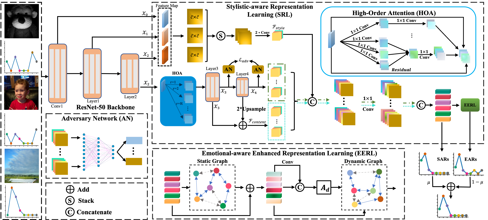
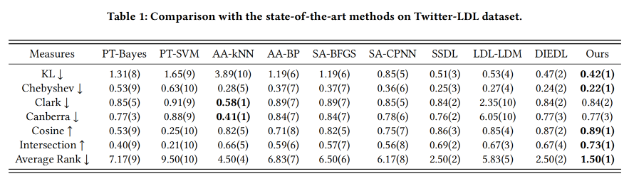
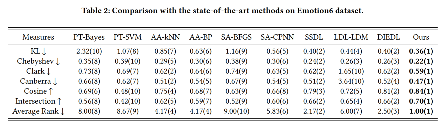
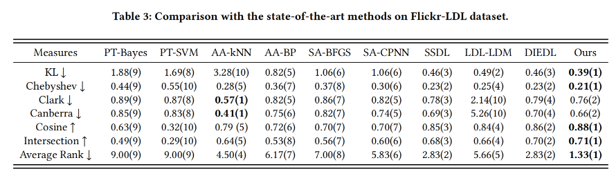

# StyleEDL: Style-Guided High-order Attention Network for Image
## Abstract
the tendency to express emotions through images. As for emotion
ambiguity arising from humans’ subjectivity, substantial previous
methods generally focused on learning appropriate representations
from the holistic or significant part of images. However, they rarely
consider establishing connections with the stylistic information although it can lead to a better understanding of images. In this paper,
we propose a style-guided high-order attention network for image
emotion distribution learning termed StyleEDL, which interactively
learns stylistic-aware representations of images by exploring the
hierarchical stylistic information of visual contents. Specifically, we
consider exploring the intra- and inter-layer correlations among
GRAM-based stylistic representations, and meanwhile exploit an
adversary-constrained high-order attention mechanism to capture
potential interactions between subtle visual parts. In addition, we
introduce a stylistic graph convolutional network to dynamically
generate the content-dependent emotion representations to benefit the final emotion distribution learning. Extensive experiments
conducted on several benchmark datasets demonstrate the effectiveness of our proposed StyleEDL compared to state-of-the-art
methods.

## Method


## Results
### Twitter-LDL ([log](logs/Twitter_LDL/train.log))


### Emotion6 ([log](logs/Emotion6/train.log))


### Flickr-LDL ([log](logs/Flickr_LDL/train.log))


## Installation
```bash
conda env create -f env.yaml
```

## train
```bash
python main.py --tag xxx
```
+ `--tag` the log will saved at `logs/$datetime.time$xxx`

## Citation
If you find this repository helpful, please consider citing:
```
add latter.
```
